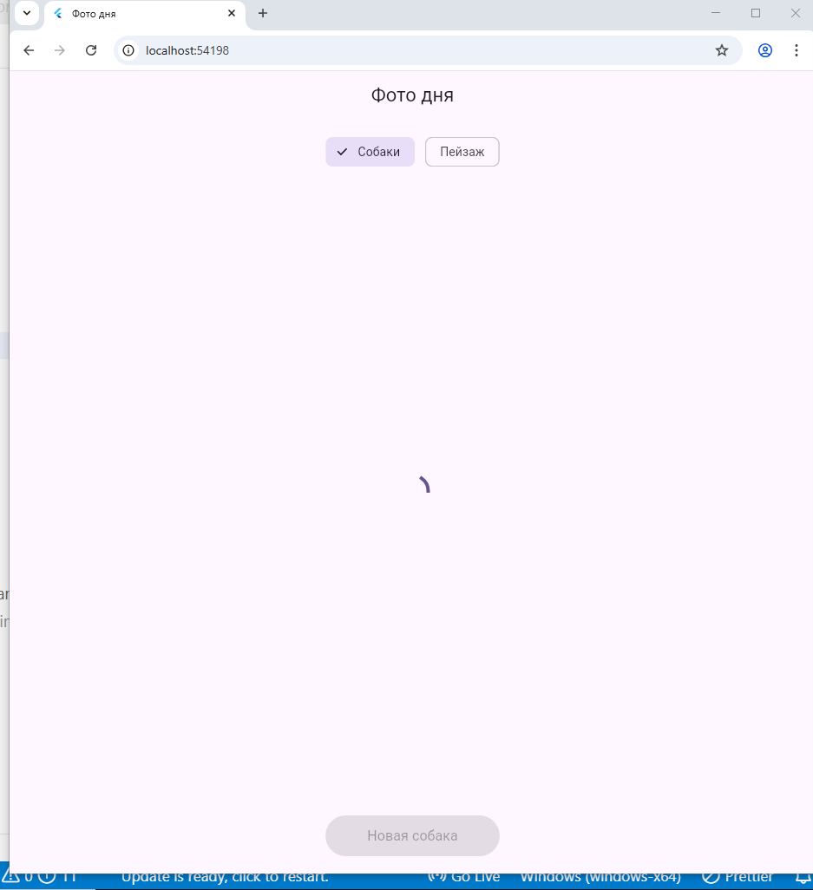

# Лабораторная работа №5 - Асинхронность в Dart и Flutter. Приложение «Фото дня»

## Описание проекта

Приложение для загрузки случайных фотографий собак и пейзажей из интернета. Демонстрирует работу с асинхронными запросами, Future, async/await и состояниями загрузки во Flutter.

## Информация об авторе

- **Имя:** Ткаченко Виктория
- **Группа:** ИСП-231

## Стек и версии

| Технология | Версия |
|------------|--------|
| Flutter | 3.0+ |
| Dart | 3.0+ |
| Платформа | Web (Chrome) |
| Пакет | http |

## Скриншот приложения



##  Инструкция по запуску

1. **Клонировать репозиторий:**
   ```bash
   git clone https://github.com/vikatkacenko35_marker/Flutter_Lab5.git
   cd Flutter_Lab3
   ```
Установить зависимости:

```bash
flutter pub get
```
Запустить в Chrome:

```bash
flutter run -d chrome
```
## Что изучили в ходе работы

- Понятие Future<T> и асинхронного программирования в Dart
- Использование ключевых слов async и await для написания асинхронного кода
- Отправку HTTP-запросов через пакет http
- Парсинг JSON-ответов от API с помощью jsonDecode()
- Управление состояниями загрузки, ошибок и успешного ответа в Flutter
- Работу с Image.network() для загрузки изображений из интернета
- Использование ChoiceChip для переключения между типами контента

## Ответы на вопросы

### 1. Что такое Future<T>? Чем отличается от обычного возвращаемого значения?

Future<T> - это объект, который представляет собой результат асинхронной операции, которая будет выполнена в будущем. Обычное возвращаемое значение доступно сразу и синхронно, а Future<T> - это "обещание" получить значение типа T позже, не блокируя текущий поток выполнения.

### 2. Что делает await? Блокирует ли он весь поток выполнения?

await приостанавливает выполнение текущей асинхронной функции до завершения Future, но НЕ блокирует весь поток выполнения. Пока функция ждёт, Dart может выполнять другие задачи (обрабатывать события UI, таймеры и т.д.). Это неблокирующее ожидание, в отличие от Thread.sleep() в других языках.

### 3. Зачем setState() вызывается дважды в _fetchPhoto()?

Первый setState() в начале метода нужен, чтобы:
- Установить _isLoading = true (показать индикатор загрузки)
- Очистить предыдущие _imageUrl и _errorMessage

Второй setState() в конце метода (в блоке finally или после try/catch) нужен, чтобы:
- Установить _isLoading = false (скрыть индикатор)
- Отобразить загруженное фото или сообщение об ошибке

### 4. Почему кнопке передаётся _fetchPhoto без скобок, а не _fetchPhoto()?

_fetchPhoto без скобок - это ссылка на функцию. onPressed ожидает функцию-обработчик, которая будет вызвана при нажатии кнопки. Если написать _fetchPhoto() со скобками, функция выполнится сразу при построении виджета (до нажатия кнопки), а не при клике.

### 5. Чем Image.network() отличается от Image.asset()?

| Характеристика | Image.network() | Image.asset() |
|----------------|-----------------|---------------|
| Источник | URL из интернета | Локальный файл из assets |
| Требует подключения | Да | Нет |
| Настройка в pubspec.yaml | Нет | Да (нужно регистрировать папку) |
| Время загрузки | Асинхронное (может быть задержка) | Мгновенное |
| Кэширование | Встроенное (Flutter кэширует) | Не требуется |

